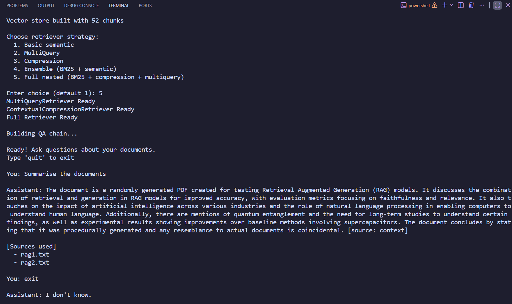

# Advanced RAG with LangChain

An interactive, modular Retrieval-Augmented Generation (RAG) project that goes beyond basic top-k semantic retrieval.

This repository demonstrates how to compare and combine multiple retrieval strategies in one pipeline:

- Basic semantic retrieval (FAISS + embeddings)
- MultiQuery retrieval
- Contextual compression retrieval
- Ensemble retrieval (BM25 + semantic)
- Full nested retrieval (BM25 + MultiQuery + compression)

The goal is simple: improve answer quality and grounding by retrieving better context before generation.

https://github.com/user-attachments/assets/0b09bd9e-bbc8-45ba-9ee6-fbd6c0b5c951



## Why this project

Naive RAG can fail when chunks are repetitive, noisy, or semantically close but not actually useful.

This project addresses that by letting you choose stronger retriever strategies at runtime, while keeping the rest of the QA chain consistent for fair comparison.

## Project architecture

```text
User Query
	|
	v
Retriever (choose one at runtime)
	|-- Basic semantic
	|-- MultiQuery
	|-- Compression
	|-- Ensemble
	|-- Full nested
	v
Retrieved Context Chunks
	v
Chat Prompt (strictly context-grounded)
	v
LLM (gpt-4o-mini)
	v
Answer + source display
```

## Repository structure

- `main.py`: interactive CLI app, document ingestion flow, retriever selection, QA loop
- `loader.py`: `.pdf` and `.txt` loading
- `splitter.py`: chunking via `RecursiveCharacterTextSplitter`
- `vectorstore.py`: embeddings + FAISS index creation
- `retriever.py`: all advanced retriever builders
- `chain.py`: prompt + retrieval chain assembly
- `rag1.txt`, `rag2.txt`: sample documents for testing
- `assets/output.png`: terminal output screenshot

## Retriever strategies included

| Option | Strategy | What it does | Best when |
|---|---|---|---|
| 1 | Basic semantic | Top-k vector similarity from FAISS | You want fast baseline behavior |
| 2 | MultiQuery | Expands user query into multiple variants before retrieval | User questions are ambiguous or underspecified |
| 3 | Compression | Retrieves docs then compresses/extracts only relevant spans with LLM | Context is long/noisy and token budget matters |
| 4 | Ensemble | Combines BM25 lexical + semantic retriever | Keywords and semantics are both important |
| 5 | Full nested | BM25 + MultiQuery + compression in one layered retriever | You want strongest recall + precision mix |

## How source grounding works

The system prompt in `chain.py` enforces strict context-only answering:

- If the answer is not in retrieved context, the model should say: `I don't know`.
- It instructs the model to provide a source tag in answers.
- After each response, the CLI prints source files used from metadata.

This gives two levels of transparency:

1. In-answer source mention from the model.
2. Post-answer source list from retrieved docs.

## Prerequisites

- Python 3.10+
- OpenAI API key

## Setup

1. Clone the repo and enter the project folder.
2. Create and activate a virtual environment.
3. Install dependencies.
4. Add environment variables.

Example:

```bash
python -m venv .venv
source .venv/bin/activate
pip install -U pip
pip install langchain langchain-openai langchain-community langchain-text-splitters langchain-classic faiss-cpu python-dotenv pypdf rank-bm25
```

Create a `.env` file:

```env
OPENAI_API_KEY=your_openai_api_key_here
```

## Run the project

```bash
python main.py
```

You will be prompted to provide document paths one by one.

Quick demo input:

```text
File 1: rag1.txt
File 2: rag2.txt
File 3:
```

Then choose a retriever strategy:

```text
1. Basic semantic
2. MultiQuery
3. Compression
4. Ensemble (BM25 + semantic)
5. Full nested (BM25 + compression + multiquery)
```

Ask questions in the loop, then type `quit` to exit.

## Example questions

- Summarize both documents.
- What recurring themes appear across sources?
- Which technologies are mentioned in the technical sections?
- What limitations are described?
- What does the data say about performance improvements?

## Design choices in this codebase

- Shared LLM choice: `gpt-4o-mini` for generation and retrieval helpers.
- Embeddings model: `text-embedding-3-small` for efficient FAISS indexing.
- Chunking defaults in `main.py`: `chunk_size=500`, `chunk_overlap=100`.
- Ensemble weights: 40% BM25 and 60% semantic retriever.

These defaults are practical starting points and easy to tune.

## Common customization ideas

- Change chunk size/overlap in `main.py` for your document type.
- Increase/decrease `k` in retriever constructors for recall vs precision.
- Tune ensemble weights in `retriever.py`.
- Swap LLM or embeddings model for speed/cost/quality tradeoffs.
- Add support for more file types in `loader.py`.

## Troubleshooting

- `ModuleNotFoundError`:
  Install missing libraries in your active virtual environment.
- API key errors:
  Verify `.env` exists and includes `OPENAI_API_KEY`.
- Empty or weak answers:
  Try retriever option 4 or 5, then inspect retrieved sources.
- Unsupported file format:
  Current loader supports `.pdf` and `.txt`.

## Future improvements

- Add evaluation metrics (faithfulness, relevance, answer correctness).
- Add experiment logging to compare retriever quality.
- Add persistence for FAISS index.
- Add web UI (Streamlit/FastAPI) for interactive demos.

## License

No license file is currently included. Add one if you plan to distribute or reuse this project publicly.
